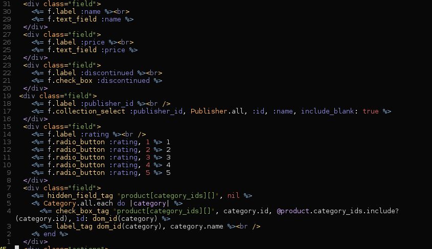
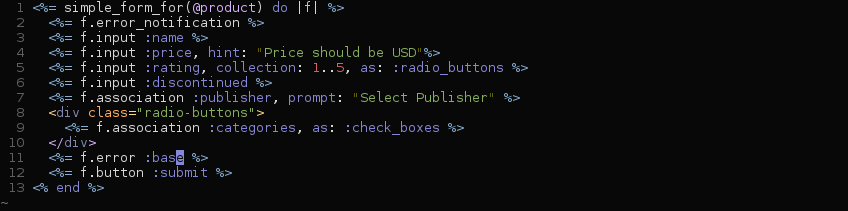
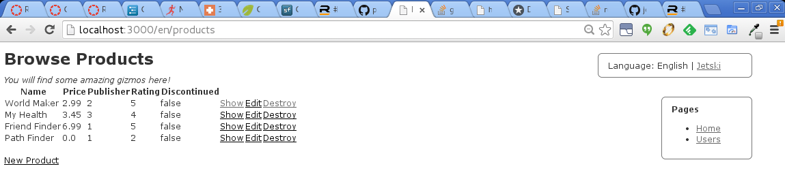
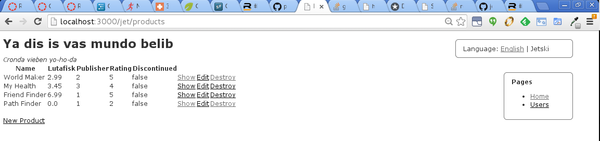
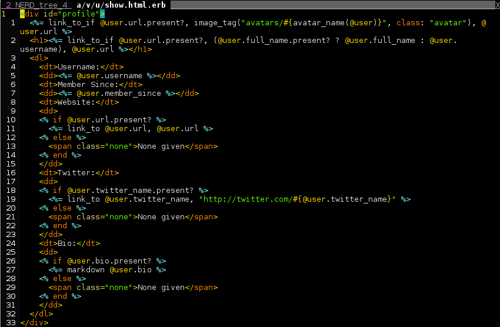
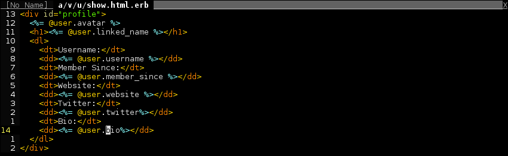

Rails Views: Simple Form, I18n, Presenter Pattern, and Template Inheritance
===========================================================================

### Streamlining your Rails Views.

#### Requirements

* Ruby version:  2.1.0
* Rails: 4.0.2
* Gems:  Draper, RedCarpet, SimpleForm, sqlite3

### Simple Form

Simple form allows you to streamline your views by making it incredibly
easy to implement complex forms.

#### Install

Add ``` gem 'simple_form' ``` to your Gemfile
Run ``` rails g simple_form:install ```

### Before using Simple Form



### After using Simple Form



### I18n Implementation

English Lanuage



Jetski Language



### Refactor and Implement Presenter Pattern with Draper

user.html.erb before refactor and implementing presenter pattern



user.html.erb after refactor and implementing presenter pattern


